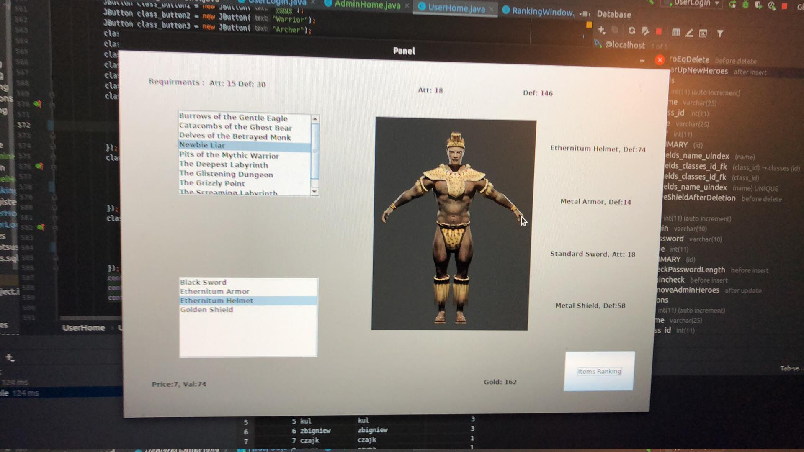
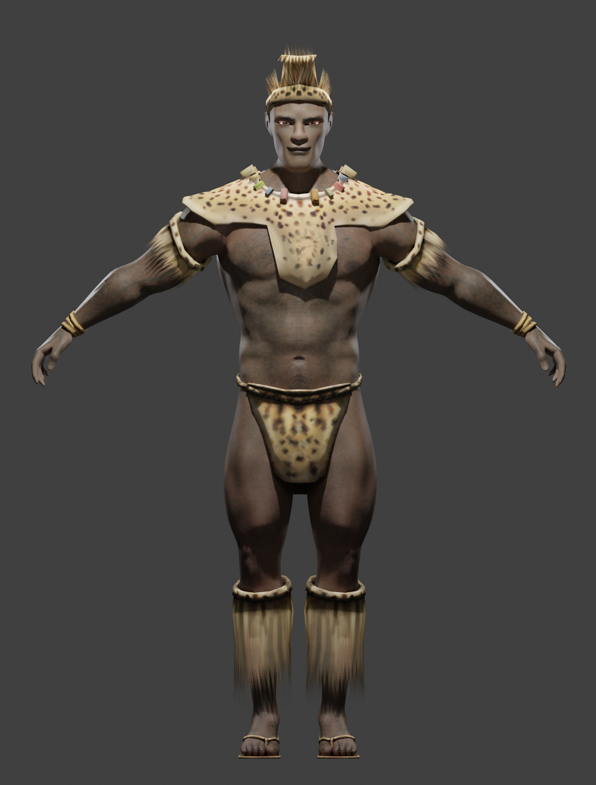

# Warrios of Enartia

## Table of contents
* [Introduction](#Introduction)
* [General Info](#general-info)
* [Details](#details)
* [Database](#database)
* [Models](#models)
* [Code Example](#code-example)
* [Launch](#launch)
* [Installation](#installation)
* [Technologies](#technologies)


## Introduction
Role-play game consisting in incarnation into your own hero.
Each gamer has its own account, registered in the database.
Registration data is verified by the appropriate subsystem.
On the created account with a unique login, a hero is created in one of the selected classes.
Archer, Mage and Warrior are currently implemented.
Heroes initially receives basic equipment, which is enough for a few basic 
expeditions in which the player is doing relatively well to the class.
The player sends his heroes on a journey. 
To be able to take part in an expedition, 
he must not take part in another one and must have sufficiently good equipment.
 The more difficult the mission, the better equipment the player must have.
After completing the mission, the player receives the appropriate amount of raw materials, e.g. gold, which can be exchanged for other equipment in the store.
The game has a ranking of heroes based on their attack and defensively. 
Character ranking is general or class and item ranking is separate.

## Code Example
```java
public void actionPerformed(ActionEvent e) {
    try {
        Connection connection = (Connection) DriverManager.getConnection("jdbc:mysql://localhost:3306/project", "root", "secret");
        RegisterPanel ah = new RegisterPanel(connection);
        ah.setTitle("Register Panel");
        ah.setVisible(true);
    } catch (SQLException | IOException sqlException) {
        sqlException.printStackTrace();
    }
}
```

## General Info
The GUI of the application was written in Java (Swing).
The database part consists of the MySQL relational database.
Communication between the above technologies is ensured by the
 JDBC software interface, the 'Connection Pooling' technique, which 
 reduces the number of costly connections with the database to a minimum. 
 Designed in a way that is open to further development of the application,
 adding new classes, items or the expeditions themselves.

## Details
The application can be used in various ways.
 It can be a virtual character system or used for
various simulations or as a game. 
The window application had been written in Java and will be linked
with a relational MySQL database.
 The application will consist of various subsystems, functionalities:
- Login system,
- Registration system,
- Dungeons,
- Inventory system,
- System of obtaining resources,
 
### Account Types and permissions

#### Admin
- on the basis of the DELETE clause, he will be able to delete the accounts of individual players if it decides that
your property in an unlawful manner.
- browse all tables using SELECT
- able to modify raw materials, items and change the player's equipment thanks to the ALTER TABLE clauses and
update, e.g. award for 1st place in the ranking.
- the right to add accounts thanks to the INSERT clause, (!HINT) 
[in this game another admin can be added only by another Admin. There are no headAdmins. Their permissions are equal.]
- By using INSERT INTO he has the right to add new items to the possible available weapons.
- Removal of items

#### User
- The user has access to the SELECT clause, because he has to browse his inventory and items
 possible to get for example from shop.
- if the conditions are met, he will be able to use the update to change his subject.
  
#### Premium User
- The user has access to the SELECT clause, because he has to browse his inventory and items
 possible to get for example from shop.
- if the conditions are met, he will be able to use the update to change his subject.
- Since he is a VIP, she will receive more resources in the result of an expedition or a half.
## Database
In order to ensure consistent functionality and database optimization, constrains, triggers, dynamic queries, indexes, transactions, backup & restore were used.
### UML

### Triggers 
- ON INSERT on users checks if login is taken
- ON INSERT on users checks the password if it is correct.
- ON INSERT on heroes to add standard starting items for the appropriate class.
- ON DELETE on weapons or some player does not have a weapon that we want to remove.
- ON DELETE na, helmets or some player does not have a helm that we want to delete.
- ON DELETE on shields or some player does not have a shield that we want to remove.
- ON DELETE on armors or some player does not have any armor that we want to remove.
- ON UPDATE on equipment, whether heroes has enough resources to change eq for the better.
- ON UPDATE on equipment, so that he can check if the appropriate class uses the correct items
### Procedures
- procedure for adding standard class items for a new character.
- procedure for adding gold, silver, wood ; weapons, armor, shield, helm
- procedure to pay the first player in the ranking
## Models ( static images )
### Warrior


### Archer


### Mage


## Launch
```shell script
java UserLogin
```

## Installation

Install using Maven.

## Technologies
 - java
 - mysql
 - swing
 - jdbc
 